# Module Dependency Graph

## Purpose
This document is generated from direct `#include` relationships in `Modules/`.
It tracks the direct module-to-module dependencies that are visible from the source tree.
The arrow direction always flows from the dependent module to the module it uses.
For a broader architecture view grouped by layer, see [Docs/module_layering.md](module_layering.md).

## Legend
- `A --> B` means module `A` depends on module `B`.

## Direct dependencies

| Module | Direct dependencies |
| --- | --- |
| `API` | `Basic`, `CMA`, `CPP_class`, `Compression`, `Encryption`, `Errno`, `JSon`, `Logger`, `Networking`, `Observability`, `PThread`, `Printf`, `System_utils`, `Template`, `Threading`, `Time` |
| `Advanced` | `Basic`, `CMA`, `CPP_class`, `Errno`, `PThread`, `System_utils` |
| `Application` | `Basic`, `CMA`, `CPP_class`, `Encoding`, `Encryption`, `Errno`, `Filesystem`, `PThread`, `Printf`, `Storage`, `System_utils`, `Template`, `Time` |
| `Basic` | `Errno` |
| `Buffer` | `Basic`, `CMA`, `Errno`, `PThread` |
| `CLI` | `Basic`, `CPP_class`, `Errno`, `File`, `PThread` |
| `CMA` | `Basic`, `Compatebility`, `Errno`, `PThread`, `Sink`, `System_utils` |
| `CPP_class` | `Advanced`, `Basic`, `CMA`, `Errno`, `PThread`, `Printf`, `System_utils`, `Template` |
| `CSV` | `Basic`, `CPP_class`, `Errno`, `File`, `PThread`, `Parser`, `Template` |
| `Command` | `Basic`, `Errno` |
| `Compatebility` | `Basic`, `CMA`, `CrossProcess`, `DUMB`, `Errno`, `File`, `PThread`, `System_utils` |
| `Compression` | `Basic`, `CPP_class`, `PThread`, `Printf`, `System_utils`, `Template` |
| `Config` | `Advanced`, `Basic`, `CMA`, `Compatebility`, `Errno`, `File`, `JSon`, `PThread`, `Printf` |
| `CrossProcess` | `Basic`, `CPP_class`, `Compatebility`, `Errno`, `PThread` |
| `DUMB` | `Basic`, `CMA`, `CPP_class`, `Compatebility`, `Errno`, `GetNextLine`, `PThread` |
| `Debug` | `Basic`, `Compatebility`, `Errno` |
| `Encoding` | `Basic`, `CMA`, `Errno` |
| `Encryption` | `Basic`, `CMA`, `CPP_class`, `Compatebility`, `Errno`, `Networking`, `PThread`, `RNG`, `System_utils`, `Template` |
| `Errno` | `Basic`, `Compatebility`, `PThread` |
| `File` | `Basic`, `CMA`, `CPP_class`, `Compatebility`, `Encryption`, `Errno`, `Observability`, `PThread`, `RNG`, `Template`, `Threading` |
| `Filesystem` | `Basic`, `CMA`, `CPP_class`, `Compatebility`, `Errno`, `File`, `PThread`, `Time` |
| `Game` | `Basic`, `Buffer`, `CMA`, `CPP_class`, `Errno`, `File`, `Geometry`, `JSon`, `Networking`, `Observability`, `PThread`, `Printf`, `Storage`, `System_utils`, `Template`, `Time` |
| `Geometry` | `Errno`, `Math`, `PThread` |
| `GetNextLine` | `Basic`, `CMA`, `CPP_class`, `Compatebility`, `Errno`, `PThread`, `Template` |
| `HTML` | `Advanced`, `Basic`, `CMA`, `Compatebility`, `Errno`, `PThread`, `Printf`, `System_utils` |
| `JSon` | `Advanced`, `Basic`, `CMA`, `CPP_class`, `Compatebility`, `Errno`, `PThread`, `Parser`, `Printf`, `System_utils`, `Template` |
| `Logger` | `Basic`, `CMA`, `CPP_class`, `Compatebility`, `Errno`, `Networking`, `PThread`, `Printf`, `Sink`, `System_utils`, `Template`, `Time` |
| `Math` | `Basic`, `CMA`, `CPP_class`, `Errno`, `GetNextLine`, `PThread`, `Printf`, `RNG`, `Template` |
| `Networking` | `Basic`, `CMA`, `CPP_class`, `Compatebility`, `Compression`, `Encryption`, `Errno`, `Observability`, `PThread`, `Printf`, `RNG`, `System_utils`, `Template`, `Threading`, `Time` |
| `Observability` | `Basic`, `CMA`, `Errno`, `PThread`, `Template`, `Threading`, `Time` |
| `PThread` | `Basic`, `Compatebility`, `Errno`, `System_utils`, `Time` |
| `Parser` | `Basic`, `CMA`, `CPP_class`, `Errno`, `Networking`, `Observability`, `PThread`, `Printf`, `System_utils`, `Template` |
| `Printf` | `Basic`, `CPP_class`, `Errno`, `PThread`, `System_utils` |
| `RNG` | `Advanced`, `Basic`, `CMA`, `CPP_class`, `Compatebility`, `Errno`, `Math`, `PThread`, `Printf`, `Template` |
| `ReadLine` | `Advanced`, `Basic`, `CMA`, `CPP_class`, `Compatebility`, `Errno`, `GetNextLine`, `JSon`, `PThread`, `Printf`, `System_utils` |
| `SCMA` | `Basic`, `Compatebility`, `Errno`, `PThread` |
| `Sink` | `Basic`, `Errno` |
| `Storage` | `Basic`, `CMA`, `CPP_class`, `Compatebility`, `Compression`, `Encryption`, `Errno`, `GetNextLine`, `JSon`, `PThread`, `Parser`, `Printf`, `System_utils`, `Template`, `Threading`, `Time` |
| `System_utils` | `Basic`, `CMA`, `CPP_class`, `Compatebility`, `Errno`, `File`, `PThread`, `Printf`, `SCMA`, `Sink`, `Template` |
| `Template` | `Basic`, `CMA`, `CPP_class`, `Errno`, `JSon`, `PThread`, `Printf`, `RNG`, `YAML` |
| `Threading` | `Basic`, `CMA`, `Errno`, `PThread`, `System_utils`, `Template`, `Time` |
| `Time` | `Basic`, `CMA`, `CPP_class`, `Compatebility`, `Errno`, `PThread` |
| `URI` | `Basic`, `CMA`, `Errno` |
| `Voxel` | `Basic`, `Errno`, `Game`, `Geometry`, `Math`, `RNG`, `Template` |
| `XML` | `Basic`, `CMA`, `Errno`, `PThread`, `Parser`, `Template` |
| `YAML` | `Basic`, `CMA`, `CPP_class`, `Errno`, `PThread`, `Parser`, `System_utils`, `Template` |

## Visual summary
This is a simplified renderable view of the dependency flow.

```mermaid
graph TD
    API --> Basic
    API --> CMA
    API --> CPP_class
    API --> Compression
    API --> Encryption
    API --> Errno
    API --> JSon
    API --> Logger
    API --> Networking
    API --> Observability
    API --> PThread
    API --> Printf
    API --> System_utils
    API --> Template
    API --> Threading
    API --> Time
    Advanced --> Basic
    Advanced --> CMA
    Advanced --> CPP_class
    Advanced --> Errno
    Advanced --> PThread
    Advanced --> System_utils
    Application --> Basic
    Application --> CMA
    Application --> CPP_class
    Application --> Encoding
    Application --> Encryption
    Application --> Errno
    Application --> Filesystem
    Application --> PThread
    Application --> Printf
    Application --> Storage
    Application --> System_utils
    Application --> Template
    Application --> Time
    Basic --> Errno
    Buffer --> Basic
    Buffer --> CMA
    Buffer --> Errno
    Buffer --> PThread
    CLI --> Basic
    CLI --> CPP_class
    CLI --> Errno
    CLI --> File
    CLI --> PThread
    CMA --> Basic
    CMA --> Compatebility
    CMA --> Errno
    CMA --> PThread
    CMA --> Sink
    CMA --> System_utils
    CPP_class --> Advanced
    CPP_class --> Basic
    CPP_class --> CMA
    CPP_class --> Errno
    CPP_class --> PThread
    CPP_class --> Printf
    CPP_class --> System_utils
    CPP_class --> Template
    CSV --> Basic
    CSV --> CPP_class
    CSV --> Errno
    CSV --> File
    CSV --> PThread
    CSV --> Parser
    CSV --> Template
    Command --> Basic
    Command --> Errno
    Compatebility --> Basic
    Compatebility --> CMA
    Compatebility --> CrossProcess
    Compatebility --> DUMB
    Compatebility --> Errno
    Compatebility --> File
    Compatebility --> PThread
    Compatebility --> System_utils
    Compression --> Basic
    Compression --> CPP_class
    Compression --> PThread
    Compression --> Printf
    Compression --> System_utils
    Compression --> Template
    Config --> Advanced
    Config --> Basic
    Config --> CMA
    Config --> Compatebility
    Config --> Errno
    Config --> File
    Config --> JSon
    Config --> PThread
    Config --> Printf
    CrossProcess --> Basic
    CrossProcess --> CPP_class
    CrossProcess --> Compatebility
    CrossProcess --> Errno
    CrossProcess --> PThread
    DUMB --> Basic
    DUMB --> CMA
    DUMB --> CPP_class
    DUMB --> Compatebility
    DUMB --> Errno
    DUMB --> GetNextLine
    DUMB --> PThread
    Debug --> Basic
    Debug --> Compatebility
    Debug --> Errno
    Encoding --> Basic
    Encoding --> CMA
    Encoding --> Errno
    Encryption --> Basic
    Encryption --> CMA
    Encryption --> CPP_class
    Encryption --> Compatebility
    Encryption --> Errno
    Encryption --> Networking
    Encryption --> PThread
    Encryption --> RNG
    Encryption --> System_utils
    Encryption --> Template
    Errno --> Basic
    Errno --> Compatebility
    Errno --> PThread
    File --> Basic
    File --> CMA
    File --> CPP_class
    File --> Compatebility
    File --> Encryption
    File --> Errno
    File --> Observability
    File --> PThread
    File --> RNG
    File --> Template
    File --> Threading
    Filesystem --> Basic
    Filesystem --> CMA
    Filesystem --> CPP_class
    Filesystem --> Compatebility
    Filesystem --> Errno
    Filesystem --> File
    Filesystem --> PThread
    Filesystem --> Time
    Game --> Basic
    Game --> Buffer
    Game --> CMA
    Game --> CPP_class
    Game --> Errno
    Game --> File
    Game --> Geometry
    Game --> JSon
    Game --> Networking
    Game --> Observability
    Game --> PThread
    Game --> Printf
    Game --> Storage
    Game --> System_utils
    Game --> Template
    Game --> Time
    Geometry --> Errno
    Geometry --> Math
    Geometry --> PThread
    GetNextLine --> Basic
    GetNextLine --> CMA
    GetNextLine --> CPP_class
    GetNextLine --> Compatebility
    GetNextLine --> Errno
    GetNextLine --> PThread
    GetNextLine --> Template
    HTML --> Advanced
    HTML --> Basic
    HTML --> CMA
    HTML --> Compatebility
    HTML --> Errno
    HTML --> PThread
    HTML --> Printf
    HTML --> System_utils
    JSon --> Advanced
    JSon --> Basic
    JSon --> CMA
    JSon --> CPP_class
    JSon --> Compatebility
    JSon --> Errno
    JSon --> PThread
    JSon --> Parser
    JSon --> Printf
    JSon --> System_utils
    JSon --> Template
    Logger --> Basic
    Logger --> CMA
    Logger --> CPP_class
    Logger --> Compatebility
    Logger --> Errno
    Logger --> Networking
    Logger --> PThread
    Logger --> Printf
    Logger --> Sink
    Logger --> System_utils
    Logger --> Template
    Logger --> Time
    Math --> Basic
    Math --> CMA
    Math --> CPP_class
    Math --> Errno
    Math --> GetNextLine
    Math --> PThread
    Math --> Printf
    Math --> RNG
    Math --> Template
    Networking --> Basic
    Networking --> CMA
    Networking --> CPP_class
    Networking --> Compatebility
    Networking --> Compression
    Networking --> Encryption
    Networking --> Errno
    Networking --> Observability
    Networking --> PThread
    Networking --> Printf
    Networking --> RNG
    Networking --> System_utils
    Networking --> Template
    Networking --> Threading
    Networking --> Time
    Observability --> Basic
    Observability --> CMA
    Observability --> Errno
    Observability --> PThread
    Observability --> Template
    Observability --> Threading
    Observability --> Time
    PThread --> Basic
    PThread --> Compatebility
    PThread --> Errno
    PThread --> System_utils
    PThread --> Time
    Parser --> Basic
    Parser --> CMA
    Parser --> CPP_class
    Parser --> Errno
    Parser --> Networking
    Parser --> Observability
    Parser --> PThread
    Parser --> Printf
    Parser --> System_utils
    Parser --> Template
    Printf --> Basic
    Printf --> CPP_class
    Printf --> Errno
    Printf --> PThread
    Printf --> System_utils
    RNG --> Advanced
    RNG --> Basic
    RNG --> CMA
    RNG --> CPP_class
    RNG --> Compatebility
    RNG --> Errno
    RNG --> Math
    RNG --> PThread
    RNG --> Printf
    RNG --> Template
    ReadLine --> Advanced
    ReadLine --> Basic
    ReadLine --> CMA
    ReadLine --> CPP_class
    ReadLine --> Compatebility
    ReadLine --> Errno
    ReadLine --> GetNextLine
    ReadLine --> JSon
    ReadLine --> PThread
    ReadLine --> Printf
    ReadLine --> System_utils
    SCMA --> Basic
    SCMA --> Compatebility
    SCMA --> Errno
    SCMA --> PThread
    Sink --> Basic
    Sink --> Errno
    Storage --> Basic
    Storage --> CMA
    Storage --> CPP_class
    Storage --> Compatebility
    Storage --> Compression
    Storage --> Encryption
    Storage --> Errno
    Storage --> GetNextLine
    Storage --> JSon
    Storage --> PThread
    Storage --> Parser
    Storage --> Printf
    Storage --> System_utils
    Storage --> Template
    Storage --> Threading
    Storage --> Time
    System_utils --> Basic
    System_utils --> CMA
    System_utils --> CPP_class
    System_utils --> Compatebility
    System_utils --> Errno
    System_utils --> File
    System_utils --> PThread
    System_utils --> Printf
    System_utils --> SCMA
    System_utils --> Sink
    System_utils --> Template
    Template --> Basic
    Template --> CMA
    Template --> CPP_class
    Template --> Errno
    Template --> JSon
    Template --> PThread
    Template --> Printf
    Template --> RNG
    Template --> YAML
    Threading --> Basic
    Threading --> CMA
    Threading --> Errno
    Threading --> PThread
    Threading --> System_utils
    Threading --> Template
    Threading --> Time
    Time --> Basic
    Time --> CMA
    Time --> CPP_class
    Time --> Compatebility
    Time --> Errno
    Time --> PThread
    URI --> Basic
    URI --> CMA
    URI --> Errno
    Voxel --> Basic
    Voxel --> Errno
    Voxel --> Game
    Voxel --> Geometry
    Voxel --> Math
    Voxel --> RNG
    Voxel --> Template
    XML --> Basic
    XML --> CMA
    XML --> Errno
    XML --> PThread
    XML --> Parser
    XML --> Template
    YAML --> Basic
    YAML --> CMA
    YAML --> CPP_class
    YAML --> Errno
    YAML --> PThread
    YAML --> Parser
    YAML --> System_utils
    YAML --> Template
```

## Maintenance rule
If a new module is added or existing includes change module-to-module dependencies, regenerate this document from the source tree in the same change set.

Generated from 611 source file(s) and 251 header file(s).
