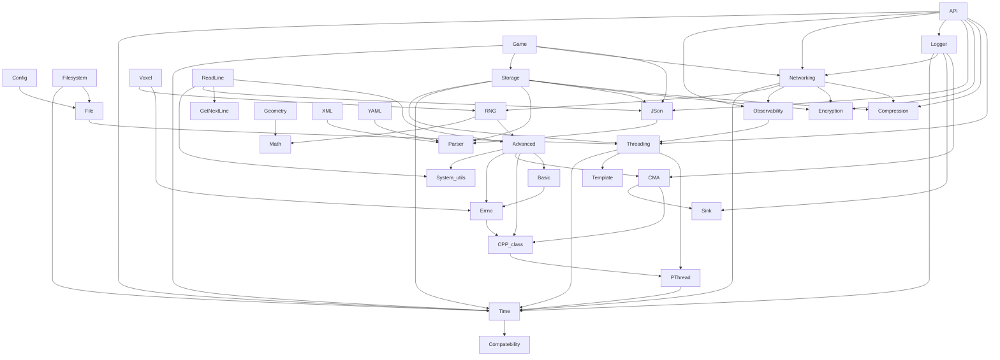

# Module Dependency Graph

## Purpose
This document tracks direct module-to-module dependencies in `Modules/`.
The arrow direction always flows from the dependent module to the module it uses.
Where noted, some edges are constant-only dependencies rather than ownership or helper-layer dependencies.
For a broader architecture view grouped by layer, see [Docs/module_layering.md](module_layering.md).

## Legend
- `A --> B` means module `A` depends on module `B`.
- `A -.-> B` means the relationship is documented architecturally in module docs or the root README, but is not directly visible in the public include graph.

## Core substrate
These modules sit closest to the shared foundation and are depended on by most higher-level modules.

| Module | Direct dependencies |
| --- | --- |
| `Advanced` | `Basic`, `CPP_class`, `CMA`, `Errno`, `System_utils` |
| `Basic` | `Errno` |
| `CMA` | `Basic`, `CPP_class`, `Compatebility`, `Errno`, `PThread`, `Sink`, `System_utils` |
| `CPP_class` | `Advanced`, `Basic`, `CMA`, `Errno`, `PThread`, `Printf`, `System_utils`, `Template` |
| `Errno` | `CPP_class`, `Compatebility`, `Printf`, `System_utils` |
| `GetNextLine` | `Basic`, `CMA`, `CPP_class`, `Compatebility`, `Errno`, `PThread`, `Template` |
| `PThread` | `Basic`, `Compatebility`, `Errno`, `System_utils`, `Time` |
| `Parser` | `Basic`, `CMA`, `CPP_class`, `Errno`, `PThread`, `Printf`, `System_utils`, `Template` |
| `Printf` | `Basic`, `CPP_class`, `Errno`, `PThread`, `System_utils` |
| `SCMA` | `Basic`, `CPP_class`, `Compatebility`, `Errno`, `PThread` |
| `Sink` | `Basic`, `Errno` |
| `System_utils` | `Basic`, `CMA`, `CPP_class`, `Compatebility`, `Errno`, `File`, `PThread`, `SCMA`, `Sink`, `Template` |
| `Template` | `Basic`, `CMA`, `Errno`, `JSon`, `PThread`, `Printf`, `RNG`, `YAML` |
| `Time` | `Basic`, `CMA`, `CPP_class`, `Compatebility`, `Errno`, `PThread` |

## Mid-level modules
These modules build reusable data, parsing, file, and utility behavior on top of the core substrate.

| Module | Direct dependencies |
| --- | --- |
| `Buffer` | `Basic`, `CMA`, `CPP_class`, `Errno`, `PThread` |
| `Threading` | `Basic`, `CMA`, `Errno`, `PThread`, `System_utils`, `Template`, `Time` |
| `CLI` | `CPP_class`, `Errno`, `File` |
| `Command` | `CPP_class`, `Errno` |
| `Compatebility` | `Basic`, `CMA`, `CPP_class`, `CrossProcess`, `DUMB`, `Errno`, `File`, `PThread`, `System_utils` |
| `Compression` | `Basic`, `CMA`, `CPP_class`, `Errno`, `PThread`, `Printf`, `System_utils`, `Template` |
| `Config` | `Advanced`, `Basic`, `CMA`, `CPP_class`, `Compatebility`, `Errno`, `File`, `JSon`, `PThread`, `Printf` |
| `CrossProcess` | `Basic`, `CPP_class`, `Compatebility`, `Errno` |
| `DUMB` | `Basic`, `CMA`, `CPP_class`, `Compatebility`, `Errno`, `GetNextLine`, `PThread` |
| `Encoding` | `Basic`, `CMA`, `CPP_class`, `Errno` |
| `Encryption` | `Basic`, `CMA`, `CPP_class`, `Compatebility`, `Errno`, `Networking`, `PThread`, `RNG`, `System_utils` |
| `File` | `Basic`, `CMA`, `CPP_class`, `Compatebility`, `Encryption`, `Errno`, `Observability`, `PThread`, `RNG`, `Template`, `Threading` |
| `Filesystem` | `CMA`, `CPP_class`, `Compatebility`, `Errno`, `File`, `Time` |
| `Geometry` | `Errno`, `Math`, `PThread` |
| `HTML` | `Advanced`, `Basic`, `CMA`, `CPP_class`, `Compatebility`, `Errno`, `PThread`, `Printf`, `System_utils` |
| `JSon` | `Advanced`, `Basic`, `CMA`, `CPP_class`, `Compatebility`, `Errno`, `PThread`, `Parser`, `Printf`, `System_utils`, `Template` |
| `Logger` | `Basic`, `CMA`, `CPP_class`, `Compatebility`, `Errno`, `Networking`, `PThread`, `Printf`, `Sink`, `System_utils`, `Template`, `Time` |
| `Math` | `Basic`, `CMA`, `CPP_class`, `Errno`, `GetNextLine`, `PThread`, `Printf`, `RNG`, `Template` |
| `Networking` | `Basic`, `CMA`, `CPP_class`, `Compatebility`, `Compression`, `Encryption`, `Errno`, `Observability`, `PThread`, `Printf`, `RNG`, `System_utils`, `Template`, `Time` |
| `Observability` | `Basic`, `CMA`, `CPP_class`, `Errno`, `PThread`, `Template`, `Time`, `Threading` |
| `RNG` | `Advanced`, `Basic`, `CMA`, `CPP_class`, `Compatebility`, `Errno`, `Math`, `PThread`, `Printf`, `Template` |
| `ReadLine` | `Advanced`, `Basic`, `CMA`, `CPP_class`, `Compatebility`, `Errno`, `GetNextLine`, `JSon`, `PThread`, `Printf`, `System_utils` |
| `Storage` | `Basic`, `CMA`, `CPP_class`, `Compatebility`, `Compression`, `Encryption`, `Errno`, `GetNextLine`, `JSon`, `PThread`, `Parser`, `Printf`, `System_utils`, `Template`, `Time`, `Threading` |
| `Voxel` | `Errno`, `RNG` |
| `URI` | `Basic`, `CMA`, `CPP_class`, `Errno` |
| `XML` | `Basic`, `CMA`, `CPP_class`, `Errno`, `PThread`, `Parser`, `Template` |
| `YAML` | `Basic`, `CMA`, `CPP_class`, `Errno`, `PThread`, `Parser`, `System_utils`, `Template` |

## Higher-level modules
These modules combine the shared lower layers into user-facing features and application surfaces.

| Module | Direct dependencies |
| --- | --- |
| `API` | `Basic`, `CMA`, `CPP_class`, `Compression`, `Encryption`, `Errno`, `JSon`, `Logger`, `Networking`, `Observability`, `PThread`, `Printf`, `System_utils`, `Template`, `Time`, `Threading` |
| `CSV` | `CMA`, `CPP_class`, `Errno`, `File`, `Parser`, `Template` |
| `Game` | `Basic`, `Buffer`, `CMA`, `CPP_class`, `Errno`, `File`, `Geometry`, `JSon`, `Networking`, `Observability`, `PThread`, `Printf`, `Storage`, `System_utils`, `Template`, `Time` |

## Architectural edges from module documentation
These relationships are stated in README files or architecture notes and are useful when reading the graph as a system map.

Note: `Basic --> Errno` is currently a constants-only dependency. `Basic` uses `Errno` for `FT_ERR_*` values, but it does not depend on `Errno` helper APIs or lifecycle utilities.

| Module | Documented dependencies |
| --- | --- |
| `Filesystem` | `Compatebility`, `File` |
| `Game` | `Networking`, `RNG`, `Storage` |
| `Observability` | `Game`, `Networking` |
| `RNG` | `CMA`, `Logger` |
| `ReadLine` | `CMA`, `Logger` |
| `URI` | `API`, `CLI`, `Config`, `HTML`, `Networking` |

## Visual summary
This is a simplified renderable view of the dependency flow. It highlights the most important cross-module edges without reproducing every single table entry.

## Maintenance rule
If a new module is added, or an existing module gains a new public dependency that changes the graph, update this document in the same change set.
